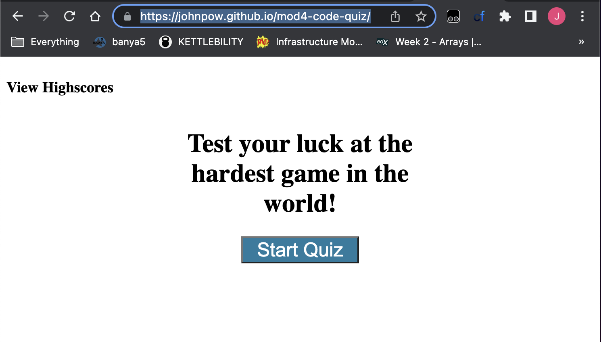

# Code Quiz (Module 4)

## Description
This quiz is one of the hardest in the world! Test your luck and try to post a high score to the score board. You will be delighted to see that your high scores will be saved over time, so you can make some progress! To play, simply click start quiz! Be sure you finish before time runs out! Incorrect answers are penalized 15 seconds. If you drop to 0, the game is automatically over :(. 

## Table of Contents
- [Usage](#usage)
- [Credits](#credits)
- [Features](#features)
- [Access](#access)

## Usage
- The player can click Start quiz to engage in a series of questions
- The player will be able to save their high score at the end and return to the scoreboard to see the same scores next time they play!
- The game can be reset and played unlimited times!

## Credits
This code uses several modules from the Week4 web APIs lessons. 

## Features
- The questions can be customized by the programmer and the correct answer can be coded to add variety
- The scoreboard saves to local storage and loads when the user comes back to play
- Clear score button will reset the scoreboard!

## Access
Click to view: [John's Crazy Quiz](https://johnpow.github.io/mod4-code-quiz/).